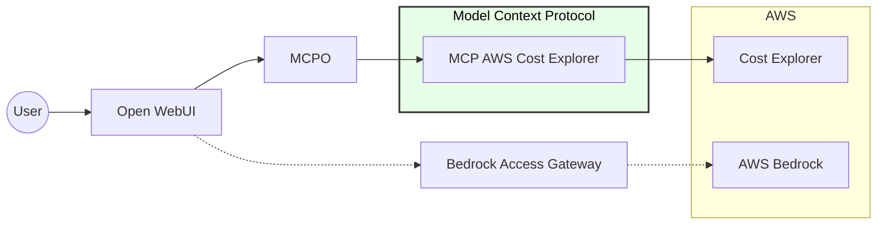

# Demo

Running `docker compose up -d ` should run up all the local environment. This includes many services that if properly set up run a UI for you to interact with your AWS Bedrock models and query "tools" (MCP servers).

## MCP

https://hub.docker.com/mcp/explore

### A bit of sense

MCP servers are nothing but a server exposing certain contract to the clients.

All of them expose the method: **tools/list** - using this method we can discover (or our AI agent) available options to interact with the tool.

Most big companies have started the path into building their MCPs, so we just need to use these methods from AI agent to query/interact with the tooling.

### Bedrock Access Gateway

This will allow us to use AWS Bedrock from MCPO UI - so the models we enable in our AWS Bedrock will be the ones used from UI to interprete the Huamn prompt. 

https://github.com/aws-samples/bedrock-access-gateway
https://docs.openwebui.com/tutorials/integrations/amazon-bedrock/

### AWS Cost Explorer MCP

https://awslabs.github.io/mcp/servers/cost-explorer-mcp-server#cost-analysis-examples

### MCPO

http://localhost:8000/docs

### Open WebUI

http://localhost:3001/
