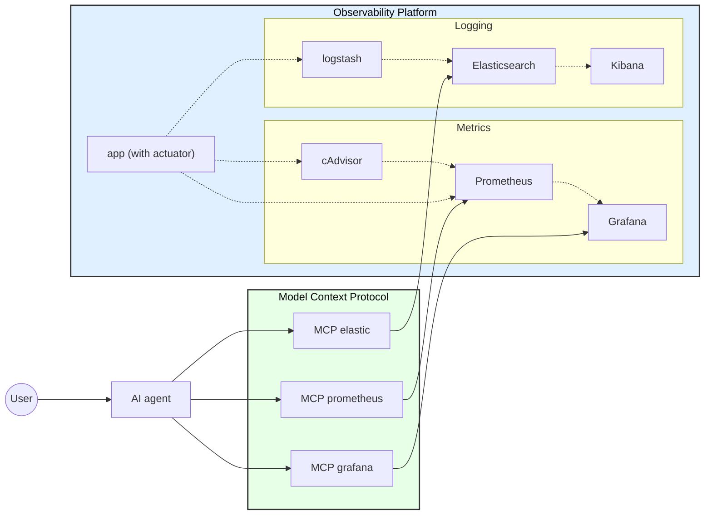

# Demo

Running `docker compose up -d ` should run up all the local environment. This includes many services in charge of both monitoring and logging just like we do in Tangram. The aim of this project is to now on top add alerts that can be delivered to a Slack channel to get the on-call process a bit more automated. 

It is important to find the right metrics for Tangram and the right alerts for the teams - and leverage it in a self-service manner when possible.

As last step, research where can AI help us improve this process even further. 



## Backend

https://docs.spring.io/spring-boot/api/rest/actuator/prometheus.html

``` bash

curl http://localhost:8081/actuator/health # all healthy
curl http://localhost:8080/actuator/prometheus # prometheus metrics working

```

## Grafana

https://grafana.com/docs/grafana-cloud/alerting-and-irm/alerting/

http://localhost:3000/

Use following credentials to access the UI:

username=admin
passowrd=admin

## Prometheus

https://prometheus.io/docs/introduction/overview/

http://localhost:9090/

check scraping is working http://localhost:9090/targets

## Logstash

https://www.elastic.co/docs/reference/logstash

## ElasticSearch

http://localhost:9200/


## Kibana

https://www.elastic.co/docs/explore-analyze/query-filter

http://localhost:5601/app/home#/


## Fake traffic for the containers

The file ./provisioning/fake_load.sh starts calling the endpoint of the services to generate networking traffic that allow us to test our metrics.


## MCP

https://hub.docker.com/mcp/explore

### A bit of sense

MCP servers are nothing but a server exposing certain contract to the clients.

All of them expose the method: **tools/list** - using this method we can discover (or our AI agent) available options to interact with the tool.

Most big companies have started the path into building their MCPs, so we just need to use these methods from AI agent to query/interact with the tooling.

### Elastic Search MCP

https://hub.docker.com/mcp/server/elasticsearch/overview
https://github.com/elastic/mcp-server-elasticsearch

List all tools in this MCP server:

``` curl

curl http://localhost:7071/mcp \
  -H 'Content-Type: application/json' \
  -H 'Accept: application/json, text/event-stream' \
  -d '{"jsonrpc":"2.0","id":1,"method":"tools/list"}'

```

Use the tool **search** to filter logs. Following example is the last 3 error logs:

``` curl

curl http://localhost:7071/mcp \
  -H 'Content-Type: application/json' \
  -H 'Accept: application/json, text/event-stream' \
  -d '{
    "jsonrpc":"2.0",
    "id":11,
    "method":"tools/call",
    "params":{
      "name":"search",
      "arguments":{
        "index":"docker-logs-*",
        "query_body":{
          "query": { "match": { "log": "error" } },
          "sort": [ { "@timestamp": { "order": "desc" } } ]
        },
        "size": 3
      }
    }
  }'

```

### Prometheus MCP

https://hub.docker.com/mcp/server/prometheus/overview
https://github.com/pab1it0/prometheus-mcp-server


Get the session ID to be able to query the server:

``` curl

curl -siN http://localhost:7072/mcp \
  -H 'Content-Type: application/json' \
  -H 'Accept: application/json, text/event-stream' \
  -d '{
    "jsonrpc":"2.0",
    "id":1,
    "method":"initialize",
    "params":{
      "protocolVersion":"2025-03-26",
      "capabilities":{},
      "clientInfo":{"name":"curl","version":"0.0.1"}
    }
  }'

```

Handshake with the session ID:

``` curl

curl -siN http://localhost:7072/mcp \
  -H 'Content-Type: application/json' \
  -H 'Accept: application/json, text/event-stream' \
  -H "mcp-session-id: d71bdbbcc4ef4994a3073580010fbd57" \
  -d '{
    "jsonrpc":"2.0",
    "method":"notifications/initialized",
    "params": {}
  }'

```

List available tools:

``` curl

curl  http://localhost:7072/mcp \
  -H 'Content-Type: application/json' \
  -H 'Accept: application/json, text/event-stream' \
  -H "mcp-session-id: d71bdbbcc4ef4994a3073580010fbd57" \
  -d '{
    "jsonrpc":"2.0",
    "id":2,
    "method":"tools/list",
    "params":{"cursor":null}
  }'

```

Query the maximum CPU value seen in the last 24 hours:

``` curl

START=$(date -u -d '24 hours ago' +%Y-%m-%dT%H:%M:%SZ)
END=$(date -u +%Y-%m-%dT%H:%M:%SZ)

curl -siN http://localhost:7072/mcp \
  -H 'Content-Type: application/json' \
  -H 'Accept: application/json, text/event-stream' \
  -H 'mcp-session-id: d71bdbbcc4ef4994a3073580010fbd57' \
  -d '{
    "jsonrpc":"2.0",
    "id":31,
    "method":"tools/call",
    "params":{
      "name":"execute_query",
      "arguments":{
        "query":"max(max_over_time(rate(container_cpu_usage_seconds_total{image=\"docker.io/library/demo-app:latest\"}[5m])[24h:]))",
        "time": null
      }
    }
  }'

```

### Grafana MCP

https://hub.docker.com/mcp/server/grafana/overview
https://hub.docker.com/r/mcp/grafana/tags


List available tools:

``` curl

curl -siN http://localhost:7073/mcp \
  -H 'Content-Type: application/json' \
  -H 'Accept: application/json, text/event-stream' \
  -d '{"jsonrpc":"2.0","id":2,"method":"tools/list","params":{"cursor":null}}'

```

Search all dashboards

``` curl

curl -siN http://localhost:7073/mcp \
  -H 'Content-Type: application/json' \
  -H 'Accept: application/json, text/event-stream' \
  -d '{
    "jsonrpc":"2.0",
    "id":12,
    "method":"tools/call",
    "params":{
      "name":"search_dashboards",
      "arguments":{"query":""}
    }
  }'

```

### Other MCPs

Attlasian (Confluence and Jira)
Sonarqube
Kubernetes
OpenAPI
aws-terraform
aws-documentation
aws-diagram
Slack
Gitlab

## Open Web UI

https://github.com/open-webui/mcpo
https://docs.openwebui.com/openapi-servers/open-webui/
https://docs.openwebui.com/getting-started/env-configuration

### MCPO

http://localhost:8000
http://localhost:8000/docs

### UI

http://localhost:3001

### Ollama

ollama pull qwen2.5:7b-instruct

### Bedrock Access Gateway

https://docs.openwebui.com/tutorials/integrations/amazon-bedrock

